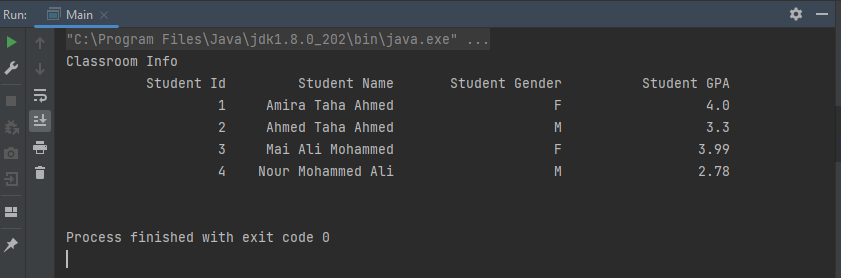

# JDBC Tasks

## Task 1

 Java application for connecting to a database on MySQL Server and executing a query which selects numbers of fields from a table and prints it with any specific format, by using load a specific driver and getting the connection using DriverManager class.

  

  

## Project Description

### Database Setup
1. Install Xampp.
2. Start Apache and MYSQL modules.
3. Open phpMyAdmin.
4. Create a new database
5. Import [SQL code](https://github.com/amira921/JobHacker-System/blob/JDBCTasks/JDBC%20Tasks/DatabaseTask1/db.sql).
6. Install [MYSQL driver](https://static.javatpoint.com/src/jdbc/mysql-connector.jar).
7. Add driver in project dependencies.

## Java Application
Singleton pattern used for database class.
Singleton class is created for the database that has only one instance and provides a global point of access to it, it Saves memory because the object is not created at each request, only a single instance is reused again and again.

**UML diagram**

