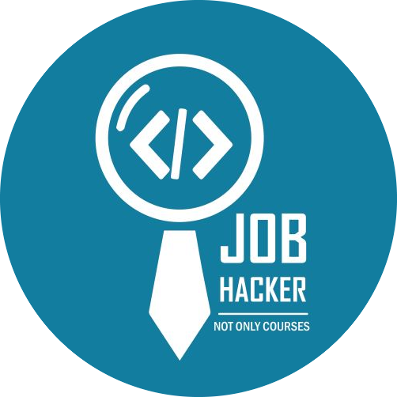

<h1 align="center">JobHacker</h1>

JobHacker repository is for Community Tasks Delivery (Java Developer Track)

<h1 align="center">Java Core</h1>

    

        <h2>1. Basics</h2>
    

    

        
1. Setup Development Environment:
   * [JDK](https://www.oracle.com/eg/java/technologies/javase/javase8-archive-downloads.html)
   *  [Java IDE](https://www.jetbrains.com/idea/download/#section=windows)

2. Study:
   * [Java Tutorial](https://www.javatpoint.com/java-tutorial) 
   * [Control Statement](https://www.javatpoint.com/control-flow-in-java) 
   * [Java Array](https://www.javatpoint.com/array-in-java) 

3. Tasks:  
   * [Extremely Basic](https://www.beecrowd.com.br/judge/en/problems/view/1001)
   * [Area of a Circle](https://www.beecrowd.com.br/judge/en/problems/view/1002)
   * [Average 2](https://www.beecrowd.com.br/judge/en/problems/view/1006)
   * [Distance Between Two Points](https://www.beecrowd.com.br/judge/en/problems/view/1015)
   * [Banknotes](https://www.beecrowd.com.br/judge/en/problems/view/1018)
   * [Multiples](https://www.beecrowd.com.br/judge/en/problems/view/1044)
   * [Even, Odd, Positive and Negative](https://www.beecrowd.com.br/judge/en/problems/view/1066)
   * [Highest and Position](https://www.beecrowd.com.br/judge/en/problems/view/1080)
   * [Squared and Cubic](https://www.beecrowd.com.br/judge/en/problems/view/1143)
   * [Array change I](https://www.beecrowd.com.br/judge/en/problems/view/1175)
   * [Array Fill II](https://www.beecrowd.com.br/judge/en/problems/view/1177)
   * [Line in Array](https://www.beecrowd.com.br/judge/en/problems/view/1181)
   * [Column in Array](https://www.beecrowd.com.br/judge/en/problems/view/1182)
   * [Below the Main Diagonal](https://www.beecrowd.com.br/judge/en/problems/view/1184)

    

        <h2>2. OOP & UML</h2>
    

    

1. Study
   * [Java Object Class](https://www.javatpoint.com/java-oops-concepts)
   * [Java Inheritance](https://www.javatpoint.com/inheritance-in-java)
   * [Java Polymorphism](https://www.javatpoint.com/method-overloading-in-java)
   * [Java Abstraction](https://www.javatpoint.com/abstract-class-in-java)
   * [Java Encapsulation](https://www.javatpoint.com/package)
   * [UML Diagram](https://www.tutorialspoint.com/uml/index.htm)
   * [Recommend Arabic video resources from 30 to 63](https://www.youtube.com/playlist?list=PLCInYL3l2AagY7fFlhCrjpLiIFybW3yQv)

2. Tasks
   * [Task1](https://drive.google.com/file/d/1FAhR9NM2KS-ex0_7UugMhWiBGT5tIos0/view)
   * Task2: Problem-Solving
      - [Valid Parentheses](https://leetcode.com/problems/valid-parentheses/)
      - [Two Sum](https://leetcode.com/problems/two-sum/)
      - [longest-common-prefix](https://leetcode.com/problems/longest-common-prefix) 
      - [check-if-the-sentence-is-pangram](https://leetcode.com/problems/check-if-the-sentence-is-pangram) 
   * Bonus Task:
      - [Book](https://drive.google.com/file/d/185hMdG0uZD6AZTwksk_FEeSUICWw7qYZ/view)
         * Ch9: 9.1, 9.2, 9.4, 9.5, 9.6, 9.13
         * Ch10: 10.3
         * Ch11: 11.1

    

        <h2>3. String</h2>
    

    

1. Study: 
[String](https://www.javatpoint.com/java-string)

2. Tasks: 
   * Task 1: Reverse a String: Write a program that takes a String input from the user and prints out the reverse of that string.
   * Task 2: Check if a String is a Palindrome: Write a program that takes a String input from the user and checks if it is a Palindrome (a word or phrase that reads the same backward as forward).
   * Task3:
      * [OOP-Task1](https://docs.google.com/document/d/1TrZxPaMaJB9fpfW0dy5q92hJwnwWyhlL7-LBz0PhlQA/edit?usp=sharing)
      * [OOP-Task2](https://docs.google.com/document/d/1Cf2GD1_tTXYkmrTzHTCL7RGtYG9N_UeIFeSCMcVD7x0/edit)
   * Bonus Task: Write a program that prints the number of occurrences of the given word in the string, Perform the above task using only methods of the String class (Using 2 ways) and Perform the above task using the StringTokenizer class.

    

        <h2>4. Exceptions & IO</h2>
    

    

1. Study
   * [Java Exceptions](https://www.javatpoint.com/exception-handling-in-java)
   * [Java Input/Output](https://www.javatpoint.com/java-io)

2. Tasks
   * Task 1: ( InputMismatchException ) Write a program that prompts the user to read two integers and displays their sum. Your program should prompt the user to  
Read the number again if the input is incorrect.

   * Task 2: (Count words) Write a program that counts the number of words in the file Task instructions:
       * Use this [input file](https://liveexample.pearsoncmg.com/data/Lincoln.txt)
       * Make a file named Lincoln.txt.
       * Copy the text on this URL and paste it into the file.
       * Print the number of the words inside the file.

   * Task 3: (Calculate the sum and average from a file) Suppose the text file on the Web [input file](http://liveexample.pearsoncmg.com/data/Scores.txt) contains an unspecified number of scores separated by spaces. Write a program that reads the scores from the internet and stores them into the file. Then, calculate the sum and average of these values. Task instructions:
      * Make a file named Scores.txt.
      * Read the values in the URL and store them inside the file.
      * Make a function that reads the values from the file and prints the sum and average of the values inside the file.  
   
      Code Structure:
         * Make a function(readFromWebToFile) that will take a URL and return a file. This method will read the data from the URL and store it in the file named Scores.txt
         * Make a function(getSum) that will take a file and return an integer value representing the sum of the values inside the file.
         * Make a function (getAverage) that will take a file and return an integer value representing the average of the values inside the file.

    

        <h2>5. Collections</h2>
    

    

1. Study:
   * [Java Collections](https://www.javatpoint.com/collections-in-java)
   * Sessions:
      * [Collection session 1](https://drive.google.com/file/d/1gFxdGLQ2Dh1WGc7Ce-n4SW-yd5TFNAZM/view?usp=sharing)
      * [Collections Session 2](https://drive.google.com/file/d/11bQjldSvjshYUc2SEqqIPHwcxbfCKL8e/view?usp=sharing)
      * [Code](https://docs.google.com/document/d/1PBdOaZh6vB4W2nLpj9DBUEDt9L9bChOmUm9HUhZFymI/edit?usp=sharing)

2. Tasks:
  * [Task1](https://drive.google.com/file/d/1rn295_TuKJdRZcFesjPrWWdJ45aSh36J/view?usp=drive_link)
  * [Task2](https://drive.google.com/file/d/1PYrBdfZ5a9sUECgCnyT2YjznYycIGzBE/view?usp=sharing)

    

        <h2>6. Java 8</h2>
    

    

1. Study: 
  * [Java 8](https://www.javatpoint.com/java-8-features)
  * [playlist](https://www.youtube.com/playlist?list=PLGRDMO4rOGcNXD2v76zM1nJybIwhBSwzZ)
  * [functional interface video](https://www.youtube.com/watch?v=lc7ljrTWZUY&list=PLGTDksrj8TisSN8RwfG1G3RqV_h4bongU&pp=iAQB)  

[2. Tasks](https://docs.google.com/document/d/1q9_URMwbQwck6M2KP96RfMC62CSSiaVuHsdkAJQYBzI/edit)  

    

        <h2>7. MySQL & JDBC</h2>
    

    

1. Study:
  * [MySQL](https://www.w3schools.com/mysql/default.asp)
  * [JDBC](https://www.javatpoint.com/jdbc-tutorial)
  * [playlist](https://www.youtube.com/playlist?list=PLEAQNNR8IlB4R7NfqBY1frapYo97L6fOQ)

[2. Tasks](https://docs.google.com/document/d/1w7HEMjEj_47cuJWUTJ2mwBNB9-dAk2gNTeLnv7QpJIg/edit?usp=drive_link)

<h1 align="center">Recap</h1>

    

        <h2>OCA & OCP Books</h2>
    

    

* OCA
   * [ch1](https://drive.google.com/file/d/1UaLAZZW6yIr_gosn5celEPZkYY0V14kB/view)
   * [ch2-part1](https://drive.google.com/file/d/1BeerDgHt24S71icVK_Hj566bKXdX4I3r/view)
   * [ch2-part2](https://drive.google.com/file/d/1-hJ8p0uT5dohEvZIKQ1_HbSrbW399p8s/view?usp=drive_link)
   * ch2-part3
   * [ch3-part1](https://drive.google.com/file/d/1LIu72OjrpsRMfhqPfJzMUKy6oS4wCMYK/view)
   * [ch3-part2](https://drive.google.com/file/d/1N4yK9bJPWCyohfVICV4MT2LFm3wjxyO5/view)
   * [ch4](https://drive.google.com/file/d/17WavWuuBOjsy5k36Js8Jx7Jrrws7-WMb/view?usp=drive_link)
   * [ch5](https://drive.google.com/file/d/1Ywjopt375sGdI0Z2xEmp5gsV1-8wcHzu/view)
   * ch6

* OCP
   * [playlist](https://www.youtube.com/watch?v=on2Kdqe6tVU&list=PLEocw3gLFc8WMfp7fGqvWkQnBwC__Dv4K)  
   * [ch1](https://elengmenofiaedu-my.sharepoint.com/:v:/g/personal/amir_ibrahim_el-eng_menofia_edu_eg/EcXHe7_PpIBNtU5UT7BCnAoBcqFBAQtLLbuLTmIUIuF8VQ)
   * [ch3 part1](https://drive.google.com/file/d/1PTIh8IJ-qddYy3Lyz6uJ-emvSfY6CA4t/view?usp=drive_link)
   * ch3 part2
   * [ch4 part1](https://elengmenofiaedu-my.sharepoint.com/✌️/g/personal/1900193_el-eng_menofia_edu_eg/EY-GeTNlQS5DiVeymZcssHsBysW-Ac7NdzFUjcBIzn4hLw?e=nhkSBr)
   * [ch4 part2](https://drive.google.com/file/d/19hC92fOHZdyA6YDf7GjdbOVbnlskRV_C/view?usp=sharing)
   * ch5
   * ch6
   * ch10
 

     

<h1 align="center">Web Basics</h1>

    

        <h2>1. Web Overview</h2>
    

    

1. Study
   * [Web overview](https://www.youtube.com/watch?v=XBu54nfzxAQ)
   * Client Server Architecture (tiers)
      * [Video 1](https://www.youtube.com/watch?v=ve82kSSj_Hs)
      * [Video 2](https://www.youtube.com/watch?v=Dg1U-jwVUrg)
      * [Video 3](https://www.youtube.com/watch?v=1o7bB4hUPew&t=505s)
   * [API](https://www.youtube.com/watch?v=dpcILJ8BTzU)
   * Web server
      * [Video 1](https://www.youtube.com/watch?v=JhpUch6lWMw&t=309s)
      * [Video 2](https://www.youtube.com/watch?v=9J1nJOivdyw)    
   * HTTP structure:
      * [Video 1](https://www.youtube.com/watch?v=iD2fgC74ZtA)
      * [Video 2](https://www.tutorialspoint.com/http/index.htm)
   * SOAP
      * [Video 1](https://www.youtube.com/watch?v=c0SrO1S4vWc)
      * [Video 2](https://www.youtube.com/watch?v=it8ybkQuAh8)
   * RESTFull APIs
      * [Tutorial: from 1 to 6](https://www.youtube.com/watch?v=ST8XxjOTIsg&list=PLTCrU9sGybupzS5-3iYTsYUI1emBDKdHu)

    

        <h2>2. Servlet & JSP</h2>
    

    

        
1. [Study](https://www.youtube.com/watch?v=OuBUUkQfBYM)
2. [Task](https://docs.google.com/document/d/1BVLNxgQGkzgAKSR44WnSB61Ca_eIaKghR-lt4OoNR2s/edit)

    

        <h2>3. XML & Maven</h2>
    

    

        
1. Study
   * [XML playlist](https://www.youtube.com/watch?v=1JblVElt5K0&list=PLhW3qG5bs-L9DloLUPwC3GdFimY5Ce_gS&index=1)
   * [XML-Recommended Arabic video](https://www.youtube.com/watch?v=shCbNDksU68&list=PLNkp62KpzogN8RlgH5K-WzGglXvZJ06iK&index=1)
   * [Maven Playlist](https://www.youtube.com/playlist?list=PLEAQNNR8IlB7uvr8EJbCNJq2I82A8cqE7)
   * [Maven Playlist 2](https://www.youtube.com/watch?v=Xatr8AZLOsE&feature=youtu.be)
   * [Maven-Recommended Arabic video](https://www.youtube.com/watch?v=miQpu1l_kt8&list=PLNkp62KpzogM0UtIhpdhhAHV1eGgeYyoU)

      
<h1 align="center">Spring Boot</h1>

    

        <h2>1. Spring Introduction</h2>
    

    

        
1. [Study](https://www.youtube.com/watch?v=JuzsKGn4z4U)
2. Task: In the Video

    

        <h2>2. Spring Core</h2>
    

    

        
[Study](https://www.youtube.com/watch?v=GB8k2-Egfv0&list=PLC97BDEFDCDD169D7)
    

    

        <h2>3. Spring Boot</h2>
    

    

        
[Study](https://www.youtube.com/watch?v=msXL2oDexqw&list=PLqq-6Pq4lTTbx8p2oCgcAQGQyqN8XeA1x&index=1)
    

    

        <h2>4. Spring MVC</h2>
    

    

    
[Study](https://www.youtube.com/watch?v=7dr4fOEgM1c)
    

    

        <h2>5. Hibernate</h2>
    

    

    
[Study](https://www.youtube.com/watch?v=Yv2xctJxE-w&list=PL4AFF701184976B25)

[Session Record](https://elengmenofiaedu-my.sharepoint.com/personal/amir_ibrahim_el-eng_menofia_edu_eg/_layouts/15/stream.aspx?id=%2Fpersonal%2Famir%5Fibrahim%5Fel%2Deng%5Fmenofia%5Fedu%5Feg%2FDocuments%2FRecordings%2FSpring%20Data%20jpa%20%26%20Hibernate%2Emp4&nav=eyJyZWZlcnJhbEluZm8iOnsicmVmZXJyYWxBcHAiOiJPbmVEcml2ZUZvckJ1c2luZXNzIiwicmVmZXJyYWxBcHBQbGF0Zm9ybSI6IldlYiIsInJlZmVycmFsTW9kZSI6InZpZXciLCJyZWZlcnJhbFZpZXciOiJNeUZpbGVzTGlua0RpcmVjdCJ9fQ&ga=1&referrer=StreamWebApp%2EWeb&referrerScenario=AddressBarCopied%2Eview)
    

    

        <h2>5. Spring Security</h2>
    

    

[Session Record](https://elengmenofiaedu-my.sharepoint.com/personal/amir_ibrahim_el-eng_menofia_edu_eg/_layouts/15/stream.aspx?id=%2Fpersonal%2Famir%5Fibrahim%5Fel%2Deng%5Fmenofia%5Fedu%5Feg%2FDocuments%2FRecordings%2FSpring%20Session%2D20230821%5F204336%2DMeeting%20Recording%2Emp4&nav=eyJyZWZlcnJhbEluZm8iOnsicmVmZXJyYWxBcHAiOiJPbmVEcml2ZUZvckJ1c2luZXNzIiwicmVmZXJyYWxBcHBQbGF0Zm9ybSI6IldlYiIsInJlZmVycmFsTW9kZSI6InZpZXciLCJyZWZlcnJhbFZpZXciOiJNeUZpbGVzTGlua0RpcmVjdCJ9fQ&ga=1&referrer=StreamWebApp%2EWeb&referrerScenario=AddressBarCopied%2Eview)
    

    

        <h2>6. Notes</h2>
    

    

        
   * [Spring Boot Topics](https://youlearncode.com/programming/spring-boot/)
   * Spring Boot Annotations Cheat Sheet:
      - [sheet 1](https://www.javaguides.net/2023/07/spring-boot-and-spring-framework.html)
      - [sheet 2](https://www.linkedin.com/feed/update/urn:li:activity:7085273997717778432/?updateEntit[…]pdate%3A%28V2%2Curn%3Ali%3Aactivity%3A7085273997717778432%29)
      - [sheet 3](https://www.linkedin.com/feed/update/urn:li:activity:7086351731999072256/?updateEntit[…]pdate%3A%28V2%2Curn%3Ali%3Aactivity%3A7086351731999072256%29)
   * Spring Boot Question and Answer:(important for interviews)
      - [QA 1](https://www.linkedin.com/feed/update/urn:li:activity:7086194622086987776/?updateEntit[…]pdate%3A%28V2%2Curn%3Ali%3Aactivity%3A7086194622086987776%29)
      - [QA 2](https://www.linkedin.com/feed/update/urn:li:activity:7035567968470093825/)

## [Spring all resources in Drive](https://drive.google.com/drive/folders/19kztglIOL6YEva1rvMA_lRZkNb5Dec_V)

<h1 align="center">Important Topics</h1>

    

        <h2>Clean Code Book sessions</h2>
    

    

   * [Clean Code Book](https://drive.google.com/file/d/1_GcS4cO4i1KgG4IH4krJ6MUVYjFm_9z-/view)
   * [Clean Code Presentation - (Ch01 to Ch07)](https://docs.google.com/presentation/d/1WbniW_8oUJtMdEA5CVu5hxgaUQ0w89xrLG0ih7vvEgo/edit?usp=sharing)
   * [playlist](https://www.youtube.com/watch?v=WnoZa933kq0&list=PLwWuxCLlF_ufTMlXoJlQvImqz9wIfcWsX&pp=iAQB)
   * [session](https://drive.google.com/drive/folders/1GQT-hikYJQ-jDoD3-atBmknIT2Kc3Xum)

 

    

        <h2>Agile sessions</h2>
    

    

   * Day 1
      * [part 1](https://elengmenofiaedu-my.sharepoint.com/:v:/g/personal/amir_ibrahim_el-eng_menofia_edu_eg/EeWdQpjH9MhGgQseQZOOoswBXgFDVt4byhT49qaQROYdXA?nav=eyJyZWZlcnJhbEluZm8iOnsicmVmZXJyYWxBcHAiOiJPbmVEcml2ZUZvckJ1c2luZXNzIiwicmVmZXJyYWxBcHBQbGF0Zm9ybSI6IldlYiIsInJlZmVycmFsTW9kZSI6InZpZXciLCJyZWZlcnJhbFZpZXciOiJNeUZpbGVzTGlua0RpcmVjdCJ9fQ&e=FQ039L)
      * [part 2](https://elengmenofiaedu-my.sharepoint.com/:v:/g/personal/amir_ibrahim_el-eng_menofia_edu_eg/ESIMwTTQh7NEoF5yl4x4FsEBr4W55elLxs6QFcyxm--dBg?nav=eyJyZWZlcnJhbEluZm8iOnsicmVmZXJyYWxBcHAiOiJPbmVEcml2ZUZvckJ1c2luZXNzIiwicmVmZXJyYWxBcHBQbGF0Zm9ybSI6IldlYiIsInJlZmVycmFsTW9kZSI6InZpZXciLCJyZWZlcnJhbFZpZXciOiJNeUZpbGVzTGlua0RpcmVjdCJ9fQ&e=XgdwAu)
      * [Presentation](https://drive.google.com/file/d/1pVRyH4NIsoHoiVvH7rb7fmDcn-4gqjH6/view?usp=drive_link)

   * Day 2
      * [part 1](https://elengmenofiaedu-my.sharepoint.com/:v:/g/personal/amir_ibrahim_el-eng_menofia_edu_eg/ESOLOaPbTR1Enl-u3iIU4qwB0AdHAa-xen3XHT4a2FTzgg?nav=eyJyZWZlcnJhbEluZm8iOnsicmVmZXJyYWxBcHAiOiJPbmVEcml2ZUZvckJ1c2luZXNzIiwicmVmZXJyYWxBcHBQbGF0Zm9ybSI6IldlYiIsInJlZmVycmFsTW9kZSI6InZpZXciLCJyZWZlcnJhbFZpZXciOiJNeUZpbGVzTGlua0RpcmVjdCJ9fQ&e=Ci1FrK)
      * [part 2](https://elengmenofiaedu-my.sharepoint.com/:v:/g/personal/amir_ibrahim_el-eng_menofia_edu_eg/EWBRMDe0_KlLpVODcTp7pzsBit1RgZQuIdD8hRuWSAfxHg?nav=eyJyZWZlcnJhbEluZm8iOnsicmVmZXJyYWxBcHAiOiJPbmVEcml2ZUZvckJ1c2luZXNzIiwicmVmZXJyYWxBcHBQbGF0Zm9ybSI6IldlYiIsInJlZmVycmFsTW9kZSI6InZpZXciLCJyZWZlcnJhbFZpZXciOiJNeUZpbGVzTGlua0RpcmVjdCJ9fQ&e=QHtzin)
      * [Presentation](https://drive.google.com/file/d/1PfCn5h_1gnV5kI6EddrteJBAyPdWXf50/view?usp=drive_link)

## [Task](https://jobhacker-community.slack.com/files/U050Y2C5YJU/F05PQU6L9KL/image.png)

    

        <h2>Solid Principles</h2>
    

    

   * [Article](https://medium.com/backticks-tildes/the-s-o-l-i-d-principles-in-pictures-b34ce2f1e898)
   * [Article](https://www.freecodecamp.org/news/solid-principles-explained-in-plain-english/)
   * [Video](https://lnkd.in/daaHPJF)
   * [Video](https://lnkd.in/dFB8FgNK)

    

        <h2> Design Patterns</h2>
    

    

  * [Singleton, Factory, builder, adapter](https://refactoring.guru/)
  * [video 12, 13, 14, 15, 17](https://www.youtube.com/watch?v=-UQND--CVew&list=PLd-dOEgzBpGnt3GuEszo_piQq52XSqAmj)

    

        <h2>HTML & CSS</h2>
    

    

* Study
   * [HTML](https://www.w3schools.com/html/)
   * [HTML tutorial](https://www.youtube.com/watch?v=6QAELgirvjs&list=PLDoPjvoNmBAw_t_XWUFbBX-c9MafPk9ji)
   * [CSS](https://www.w3schools.com/w3css/defaulT.asp)
   * [CSS tutorial](https://www.youtube.com/watch?v=X1ulCwyhCVM&list=PLDoPjvoNmBAzjsz06gkzlSrlev53MGIKe)

    

        <h2>Angular</h2>
    

    

* Day 1
   * [Part 1](https://elengmenofiaedu-my.sharepoint.com/:v:/g/personal/amir_ibrahim_el-eng_menofia_edu_eg/EQgezZPP_ktLuGmIqbtCNKkBJOgtWjCdwLVUPsv0Bh3u2A?nav=eyJyZWZlcnJhbEluZm8iOnsicmVmZXJyYWxBcHAiOiJPbmVEcml2ZUZvckJ1c2luZXNzIiwicmVmZXJyYWxBcHBQbGF0Zm9ybSI6IldlYiIsInJlZmVycmFsTW9kZSI6InZpZXciLCJyZWZlcnJhbFZpZXciOiJNeUZpbGVzTGlua0RpcmVjdCJ9fQ&e=cUQrqI)
   * [Part 2](https://elengmenofiaedu-my.sharepoint.com/:v:/g/personal/amir_ibrahim_el-eng_menofia_edu_eg/EXKKCi6Nit5IgUHE-ItnBBABuhAVBGVqg-Vx-vfAZamFDQ?nav=eyJyZWZlcnJhbEluZm8iOnsicmVmZXJyYWxBcHAiOiJPbmVEcml2ZUZvckJ1c2luZXNzIiwicmVmZXJyYWxBcHBQbGF0Zm9ybSI6IldlYiIsInJlZmVycmFsTW9kZSI6InZpZXciLCJyZWZlcnJhbFZpZXciOiJNeUZpbGVzTGlua0RpcmVjdCJ9fQ&e=QrBWgu)

* Day 2
   * [Part 1](https://elengmenofiaedu-my.sharepoint.com/:v:/g/personal/amir_ibrahim_el-eng_menofia_edu_eg/EUuyzpibe1ZGjtgCo3nc-_cBbjTdGfgpi-l-WHrplpfzmA?nav=eyJyZWZlcnJhbEluZm8iOnsicmVmZXJyYWxBcHAiOiJPbmVEcml2ZUZvckJ1c2luZXNzIiwicmVmZXJyYWxBcHBQbGF0Zm9ybSI6IldlYiIsInJlZmVycmFsTW9kZSI6InZpZXciLCJyZWZlcnJhbFZpZXciOiJNeUZpbGVzTGlua0RpcmVjdCJ9fQ&e=xWpTC6)
   * [Part 2](https://elengmenofiaedu-my.sharepoint.com/:v:/g/personal/amir_ibrahim_el-eng_menofia_edu_eg/EX37WkaP9aBGg7ojSSuDQK4B38S4yW2oaSpIzRWvHiLvFA?nav=eyJyZWZlcnJhbEluZm8iOnsicmVmZXJyYWxBcHAiOiJPbmVEcml2ZUZvckJ1c2luZXNzIiwicmVmZXJyYWxBcHBQbGF0Zm9ybSI6IldlYiIsInJlZmVycmFsTW9kZSI6InZpZXciLCJyZWZlcnJhbFZpZXciOiJNeUZpbGVzTGlua0RpcmVjdCJ9fQ&e=ANCqul)

* Day 3
   * [Part 1](https://elengmenofiaedu-my.sharepoint.com/:v:/g/personal/amir_ibrahim_el-eng_menofia_edu_eg/Ef4guJe6rUhOvLC-8EIjj7ABUQewQK4p6SoWtqxzJWPswA?nav=eyJyZWZlcnJhbEluZm8iOnsicmVmZXJyYWxBcHAiOiJPbmVEcml2ZUZvckJ1c2luZXNzIiwicmVmZXJyYWxBcHBQbGF0Zm9ybSI6IldlYiIsInJlZmVycmFsTW9kZSI6InZpZXciLCJyZWZlcnJhbFZpZXciOiJNeUZpbGVzTGlua0RpcmVjdCJ9fQ&e=CW1RfY)
   * [Part 2](https://elengmenofiaedu-my.sharepoint.com/:v:/g/personal/1900193_el-eng_menofia_edu_eg/EaPYvr_ucONGn0gvPdTckH0B4Nu1JGBaj9zY_oD0KyrGJg?e=YICu5v&nav=eyJyZWZlcnJhbEluZm8iOnsicmVmZXJyYWxBcHAiOiJTdHJlYW1XZWJBcHAiLCJyZWZlcnJhbFZpZXciOiJTaGFyZURpYWxvZyIsInJlZmVycmFsQXBwUGxhdGZvcm0iOiJXZWIiLCJyZWZlcnJhbE1vZGUiOiJ2aWV3In19)
   * [Part 3](https://elengmenofiaedu-my.sharepoint.com/:v:/g/personal/1900193_el-eng_menofia_edu_eg/ER9w49lWzWFEpYhb3-XyVgIBlQ7JjwLQPIbc3XI4kiiW-Q?nav=eyJyZWZlcnJhbEluZm8iOnsicmVmZXJyYWxBcHAiOiJTdHJlYW1XZWJBcHAiLCJyZWZlcnJhbFZpZXciOiJTaGFyZURpYWxvZyIsInJlZmVycmFsQXBwUGxhdGZvcm0iOiJXZWIiLCJyZWZlcnJhbE1vZGUiOiJ2aWV3In19&e=64ijHU)
   * [Part 4](https://elengmenofiaedu-my.sharepoint.com/:v:/g/personal/amir_ibrahim_el-eng_menofia_edu_eg/ESmFmnPDgY1Pg6qaE4UtOwYBNJF3k3dVe2mEVwFmRenu3w?nav=eyJyZWZlcnJhbEluZm8iOnsicmVmZXJyYWxBcHAiOiJPbmVEcml2ZUZvckJ1c2luZXNzIiwicmVmZXJyYWxBcHBQbGF0Zm9ybSI6IldlYiIsInJlZmVycmFsTW9kZSI6InZpZXciLCJyZWZlcnJhbFZpZXciOiJNeUZpbGVzTGlua0RpcmVjdCJ9fQ&e=z2h0je)

## [Task](https://drive.google.com/drive/folders/1m1BLzKENzypThEXD5uaz55259bJnfmah?usp=sharing)

    

        <h2>Soft Skills</h2>
    

    

   * [Session of CVs](https://drive.google.com/drive/folders/1niQRKy6EPZzvVbL_h-hPq76e_35JU1Pr?usp=sharing)
   * [Soft Skills](https://shorturl.at/nsHOU)
   * [Samples of mail body for jobs](https://docs.google.com/document/d/1EFZtdqmbJq2ZgscTJkdLsxgjsbT6VMPByOsGlfhGkPA/edit?usp=sharing)

    

        <h2>Technical skills</h2>
    

    

        
   * [interview Questions](https://www.interviewbit.com/technical-interview-questions/)
   * [cheat sheet](https://www.linkedin.com/posts/yash-garg-5333a5215_java-cheet-sheet-activity-7076764331412963328--AmU?utm_source=share&utm_medium=member_ios)
   * [Recommend Arabic videos resource from #030 JAVA - Introduction to Object-Oriented](https://www.youtube.com/playlist?list=PLCInYL3l2AagY7fFlhCrjpLiIFybW3yQv)

<h1 align="center">Projects</h1>

    

        <h2>ToDoList</h2>
    

    

* Requirements:
  * Back-end:
    * create a todo application with the following:
      - Spring Boot
      - Spring Data for database connectivity
      - Spring Security for user authentication and authorization
    * Please use Postman to test your API.

 * Front-end:
    * [Link](https://drive.google.com/drive/folders/1m1BLzKENzypThEXD5uaz55259bJnfmah?usp=sharing)
    

    

        <h2>E-Commerce</h2>
    

    

        
  - Requirements:
      - [Document](https://docs.google.com/document/d/1z5d7lbTzDwhJZNBjIh_JszCXGG90791g/edit?usp=sharing&ouid=114624475064812527364&rtpof=true&sd=true)
      - [Video](https://drive.google.com/file/d/1lUAEL65qzT9q_QQMIilxDTQgKas1Tkel/view)
      - [ERD Discussion](https://drive.google.com/file/d/1K9eeLqja8pWSV3ks6DCTBmGUVBDbn2-S/view?usp=drive_link)
      - MapStruct
          - [link 1](https://mapstruct.org/)
          - [link 2](https://www.javaguides.net/2022/12/spring-boot-mapstruct-example-tutorial.html)
          - [link 3](https://www.youtube.com/watch?v=41YHBUkwcD0&list=PLMkr7X9JBPp4fc02yWxKsbYdLyBeiO4wt)
      - [RabbitMQ](https://www.youtube.com/watch?v=0--Ll3WHMTQ)
        
    

